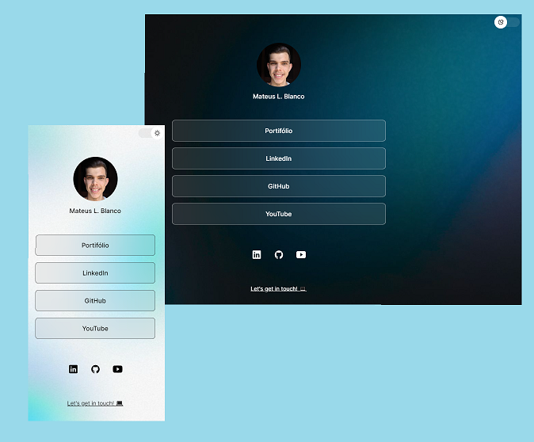

<h1 align="center"> MLB Tree </h1>

  

 

  

## 🚀 Technologies

This project was built with the following technologies:

- HTML e CSS
- JavaScript
- Git e Github
- Figma

## 💻 Project

MLBTree is a link aggregator to use as an online business card.

- [Final result, online](https://mlb-tree.vercel.app/)

## 🔖 Layout

You can view the project layout through [THIS LINK](https://www.figma.com/community/file/1187422022288947321). You must have a [Figma](https://figma.com) account to access.

## :memo: License

This project is under the MIT License.